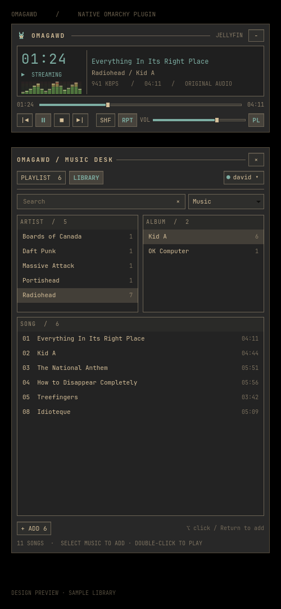

# OmaGAWD

Winamp-inspired music player for Omarchy. **Jellyfin + local files.** Use a direct Jellyfin URL; audio redirects are blocked.



```sh
git clone https://github.com/davidjpramsay/OmaGAWD.git
cd OmaGAWD && ./scripts/install.sh
```

Requires Omarchy/Quickshell, mpv, Python 3 with python-gobject, libsecret (`secret-tool`), ffmpeg (`ffprobe`), and zenity.

Open the llama icon. Choose music from the source menu. **Manage sources…** adds or removes local sources without deleting files.

| Shortcut | Action |
|---|---|
| P / L | Playlist / library |
| ⌘F / Ctrl+F | Clear filters and focus search |
| Tab / Shift+Tab | Cycle Artist → Album → Songs |
| Arrows / Space | Browse / select |
| Return / double-click | Play |
| Option/Alt-click or Option/Alt+Return | Add to queue without interrupting playback |
| Delete | Remove from queue |
| Option+↑/↓ | Reorder |
| Escape | Hide |

Open from a terminal or bind this command to **Super+Alt+O** (Command+Option+O on Mac keys), if free:

```sh
omarchy-shell shell summon david.omaamp '{}'
```

Remove with `omarchy plugin remove david.omaamp`. The script-installed launcher/icon can also be removed from `~/.local/share/applications/omaamp.desktop` and `~/.local/share/icons/hicolor/scalable/apps/omaamp.svg`. Music files, saved sources, and keyring sign-in remain.

[Setup and development notes](AGENTS.md)
