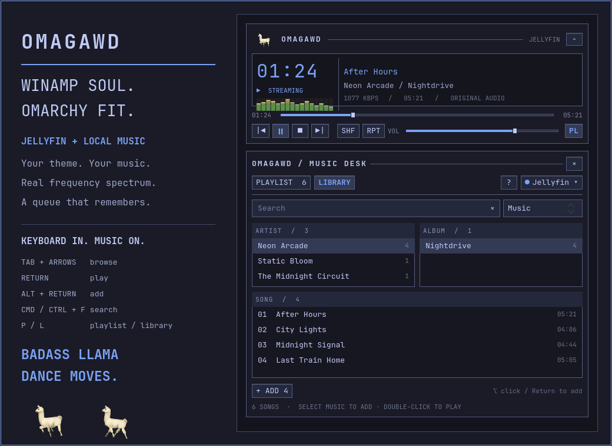
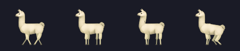

# OmaGAWD

**Winamp soul. Omarchy fit. Badass llama dance moves.**

Jellyfin, local music, and radio in a compact player that follows your Omarchy theme. Real frequency spectrum, a clean Artist → Album → Song browser, and keyboard control from search to playlist.



**Running man + side shuffle.** The player llama dances while music plays; the bar icon stays still. Prefer less motion? Toggle **Reduce motion** under **?**.



**Radio:** **Saved** starts with 14 Cliamp stations, including Omarchy, Lofi, and Synthwave. **Discover** searches [Radio Browser](https://www.radio-browser.info/) by name, genre, country, or language; select a result and **+ SAVE**. **+ STATION** accepts a name and direct audio stream link. **− FORGET** removes a saved station without touching the queue. Arrows browse, Return tunes in, Alt+Return appends. Live titles, spectrum, and llama dances work throughout; no Cliamp installation or account needed.

Your queue, playback position, volume, shuffle, and repeat are remembered. Restart restores paused. **Manage sources…** adds or forgets local files/folders without deleting music. Media keys work with the popup hidden.

## Omarchy

```sh
git clone https://github.com/davidjpramsay/OmaGAWD.git
cd OmaGAWD && ./scripts/install.sh
```

Requires Omarchy/Quickshell, mpv, Python 3 with python-gobject, libsecret (`secret-tool`), ffmpeg (`ffprobe`), and zenity. Use a direct Jellyfin URL; audio redirects are blocked. No pip/npm dependencies.

Open the llama in the bar. **?** shows the full shortcut guide.

| Shortcut | Action |
|---|---|
| P / L | Playlist / library |
| ⌘F / Ctrl+F | Clear filters and focus search |
| Tab / Shift+Tab | Cycle Artist → Album → Songs; focus radio stations |
| Arrows / Home / End | Browse and update child lists without playing |
| Space | Select / toggle filter |
| Return / double-click | Replace queue and play; play selected row in playlist |
| Option/Alt-click or Option/Alt+Return | Append without interrupting playback |
| Shift+arrows / ⌘A or Ctrl+A | Extend selection / select all in playlist |
| Delete / Backspace | Remove from queue |
| Option/Alt+↑/↓ | Reorder |
| Escape | Hide |

P/L apply outside text fields. Option is Alt. Command accepts Meta and translated Control.

Suggested global binding: **Super+Alt+O** (Command+Option+O on Mac keys), if free. Bind it to:

```sh
omarchy-shell shell summon david.omaamp '{}'
```

Update with `omarchy plugin update david.omaamp --yes`. Remove with `omarchy plugin remove david.omaamp`. The script-installed launcher/icon live at `~/.local/share/applications/omaamp.desktop` and `~/.local/share/icons/hicolor/scalable/apps/omaamp.svg`; remove those separately. Music, saved sources, playback settings, and keyring sign-in remain.

Spectrum analysis stops while hidden or paused. Server-playlist sync, file drag-and-drop, playlist import/export are not implemented. Radio accepts direct public HTTP(S) stream links; PLS/M3U playlist-file links are unsupported. Safety limits: 8 MiB per API response, 100,000 tracks per local scan or 100,000 tracks / 64 MiB per Jellyfin scan, 2 MiB of metadata per local file, 2 MiB per radio-directory response, and 1,000 saved stations/search results.

## macOS

[Download the signed macOS 0.2.1 beta](https://github.com/davidjpramsay/OmaGAWD/releases/tag/macos-v0.2.1-beta.1) (macOS 14+, Apple silicon and Intel), including **Check for Updates…**, or see the [macOS guide](macOS/README.md) for builds, shortcuts, and format support.
